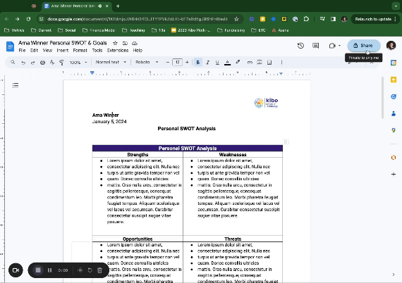

# Project: Dashboarding with Google Sheets

## Background

You have analyzed MavenFlix's subscription records and discovered customer patterns and trends. The team gained insights on subscription sign-ups, duration, and retention rates. Your supervisor wants to use this information for strategic decision-making and share findings with the CEO. You receive the email below from your supervisor. 

## The Email
> Hello Ope,
> 
> Thanks for your analysis and report, that was super useful!
>
> Building on the foundation you have laid, I believe it would be beneficial to translate your findings into a dynamic and accessible format for the team.
>
> For this week, spend some time building a dashboard showing our key performance indicators from your analysis. Feel free to add additional data points that may be useful. The dashboard should give a user the ability to filter between time periods, so that we can track KPIs over time as we get more data. 
>
>Finally, record a video showing how members of the team can use the dashboard.
>
> Please wrap this up by the end of the week.
> 
> Regards,
> 
> Bidemi

## Deliverables

You are required to submit the following:

1. A link to your dashboard in Google sheets
2. A link to your video, hosted preferrably on YouTube or Loom.

> Complete this [form](https://airtable.com/appdi1dZ5NJo3ryDG/pagYtUGRbtNcz6nrP/form) to submit your project.

> Ensure the documents are set to enable to comment. See below for a demo of how to change sharing settings. 
     
