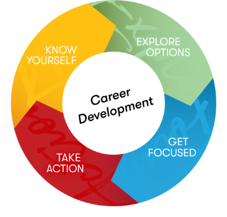

# Owning Your Career Development

<aside>
🗣 “I am not a product of my circumstances. I am a product of my decisions.”

— Stephen Covey

</aside>

## Making Your Career Count

As children, many of us are asked:  *"What do you want to be when you grow up?"* 

This suggests that, even at a young age, we should be ready to commit to a career path.  For most people, their first companies or jobs are not what they will pursue for most of their career. In fact, according to the US Bureau of Labor Statistics, most people hold an average of 12 jobs in a lifetime.

So, it’s important to remember that the aim is not to find the perfect internship or job you will have forever. Instead, the aim is to build skills, experiences, and a network that will help you thrive in the long term.

> 💡 The purpose of the professional development modules are to give you the skills to craft a meaningful career.

---

## You’re More Ready Than You Think

> 📺 How does one craft a meaningful career? Read or listen to the tome below for a perspective from Reid Hoffman, serial entrepreneur/investor and founder of LinkedIn

Click [this link](https://tome.app/reidhoffman/youre-more-ready-than-you-think-cl94ocnr82784764u5etg10rltp) to access the tome 

<aside> 💡 If the link above does not work in your region (e.g., in Nigeria), try accessing it via a VPN. Otherwise you may skip this section, and move on to "What is Career Development" below </aside>

## Reflect: You’re More Ready Than You Think

<aside>
❓ In the tome, Hoffman claims that there are three things that matter in the new world of work. 

  - You are more adaptive than you think
  - You can take more risks thank you think
  - Your network is bigger than you think

Pick one of Hoffman’s claims above and explain in your own words the main argument Hoffman is making.

</aside>

Share your thoughts in [Slack](https://automationass-9vu2026.slack.com/archives/C071Z9VBDJ9/p1714954875569299).

## What is Career Development?

Hoffman describes a common experience that many people have after university. He thought he wanted to study philosophy, began a graduate program, then realized it was not the right path. This experience — of one’s first job not being the right fit — is quite common. When it happens, the first instinct is fear or worry about having made the wrong career choice. But, as we’ll learn throughout this course, choosing one’s career is not a one-time decision. Having many jobs roles or functions is a normal part of **career development.** 

Before defining what career development is, let’s start with what it is not. There are a lot of misconceptions about what it takes to craft a rewarding career. For starters, career development is **not**:

- Deciding what you want to do for the rest of your life
- Applying for or getting a job
- Creating a rigid timeline and/or defined job progression for your career

> 💡 Career development is a lifelong, intentional process of managing one’s work and learning experiences. It involves continuously exploring, experiencing, and evaluating professional opportunities.

The illustration above breaks the career development cycle into four parts. Before we delve into each part, note that the image is cyclical. As the definition states, career development is a **lifelong process** that involves **continuous** **action**. The career development cycle includes:

- **Know yourself:** developing self-awareness and honestly assessing your interests, skills and values
- **Explore options:** understanding the workforce, market realities, and your opportunities to contribute
- **Get focused:** selecting specific goals to drive your action
- **Take action:** gaining experience and reflecting on that experience so that you can deepen your self-awareness

## Four Ideas to Guide Career Development

By the end of this training course, we hope you will agree with four key claims.

1️⃣ **Career success is a journey, not a single destination**

Getting a job is a step towards building a career, not the ultimate goal. A successful career is an ongoing process marked by continuous adaptation.

2️⃣ **Knowing yourself is the beginning of career wisdom**

To achieve career wisdom, you must first know yourself. A fulfilling career is informed by a deep understanding of your values, interests, strengths, and weaknesses.

3️⃣ **Your professional network will power future opportunities**

Building and nurturing a strong professional network is crucial. Your network will be a source of opportunities, collaboration, and knowledge sharing. The connections you cultivate, starting with your peers, will significantly influence your professional growth and success.

3️⃣ **Experience is the best teacher**

In the early stages of your career, prioritize gaining diverse and relevant experiences. Actively seek opportunities that allow you to develop skills, explore different roles, and build a strong foundation for future career growth. As Hoffman notes, “In the world of work, you don’t know what the best plan is until you try.”

In the next lesson, we'll begin to explore how to deepen your self-awareness for career success. 
