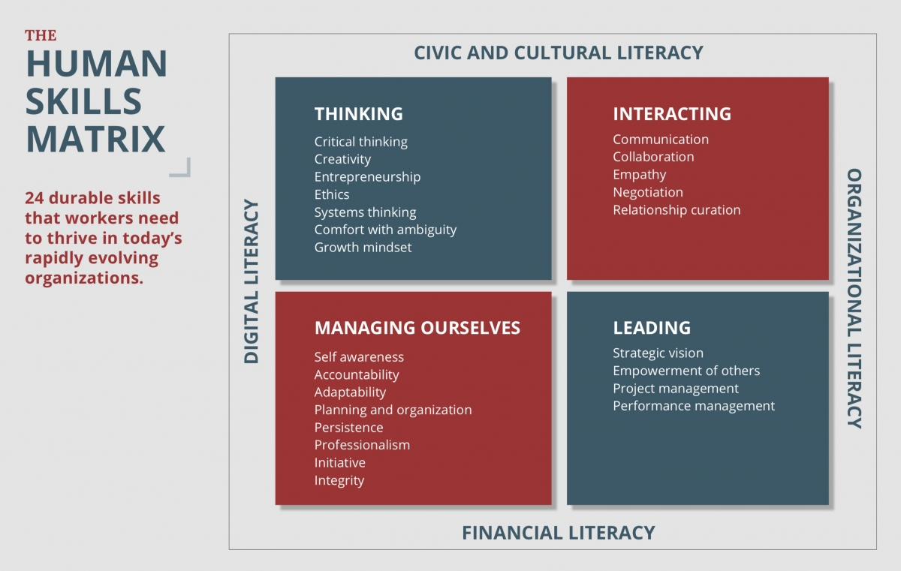

# Focus on Human Skills

> ❓ ❓ What does it take to thrive in a world of fast-changing technology?

According to MIT's [Jameel World Education Lab](https://www.jwel.mit.edu/work/posts/human-skills-matrix):

<blockquote>
 🗣  Focusing on STEM skills is not enough. Every employee, whether technical or not, needs a set of essential non-technical skills to thrive in today's digitally-powered organizations. 
</blockquote>

The aim of the Automation Assistant Training program is to prepare you to get a paid, remote role in technology. Strong technical skills are necessary, but not _sufficient_, to get entry-level roles in technology. 

More often than not, it is non-technical skills that make the biggest difference. In addition to technical topics, your training will include modules in essential non-technical to help you **land and keep** a job! 

You will practice human skills in the areas of:

- Self-management, including self-awareness, and goal setting
- Interacting with others, including communication, collaboration, and building powerful networks
- Leadership, including project management, and performance management

In this module, we begin with a focus on ownership mindset, which is essential to managing ourselves. 

## Learning Outcomes

After completing this module, you will:

- Understand why your career development requires personal responsibility, and how to take ownership of your career
- Identify your strengths and weaknesses
- Articulate your short and medium-term goals

