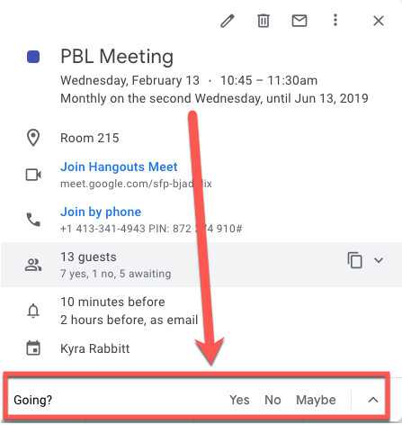

# Using Calendars at Work

Modern workplaces are fast-paced, and increasingly remote. Professionalism requires not just making efficient use of your own time, but also respecting the time of your colleagues. One of the most effective ways of doing this is to optimize your use of calendars at work. 

Using a calendar effectively helps you organize your time, avoid conflicts, and demonstrate professionalism. When you regularly update and consult your calendar, you can plan and prioritize efficiently. This ensures that you allocate appropriate time for important meetings, deadlines, and other commitments, reducing the risk of double-booking and last-minute rushes. Additionally, a well-maintained calendar reflects your reliability and commitment, enhancing your professional image.

Below are some tips for using calendars effectively at work. 

### Respond to Calendar Invitations

Responding to calendar invitations in a timely manner is a fundamental aspect of professional etiquette. When you receive an invitation, check your availability and respond as soon as possible. This helps the organizer confirm attendance and make necessary arrangements. Use your calendar's options to accept, decline, or mark as tentative based on your availability and priorities. If you need to decline, it’s courteous to provide a brief explanation or suggest alternative times.

### Check availability when scheduling meetings
Before scheduling a meeting, use your calendar to check the availability of all invitees. This minimizes scheduling conflicts and shows respect for others' time

### Include clear meeting titles and an agenda

> 📺 Watch the following video on writing clear meeting invites (2:06)

<iframe width="560" height="315" src="https://www.youtube.com/embed/Ezsb1t7GTSc?si=bougGGHNLzPUzUMV" title="Calendering" frameborder="0" allow="accelerometer; autoplay; clipboard-write; encrypted-media; gyroscope; picture-in-picture; web-share" referrerpolicy="strict-origin-when-cross-origin" allowfullscreen style="position: absolute; top: 0; left: 0; width: 100%; height: 100%;"></iframe>

### Respect time
Punctuality is crucial. Start and end meetings as scheduled to respect everyone's time. Also, try to avoid rescheduling meetings at the last minute unless absolutely necessary. Sudden changes can disrupt participants’ schedules and reduce productivity.

### Use recurring meetings when appropriate
If the same group needs to meet regularly, set up recurring meetings. This helps in long-term planning and ensures consistency in discussions and follow-ups.

