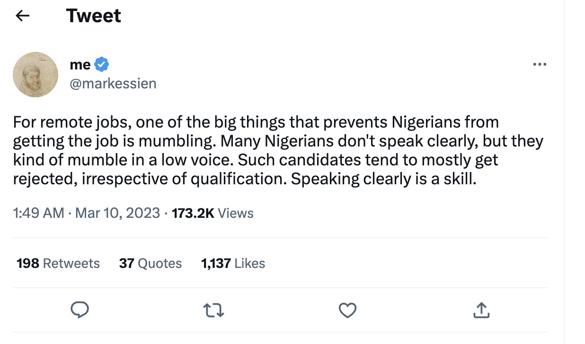

# Introduction

The tweet above was shared by Mark Essien, the founder of Hotels.ng and the HNG internship program, which has engaged tens of thousands of Africans in learning tech. While the tweet represents one person's opinion and may not be true of all Nigerians or all Africans, it underscores an important message: **speaking well matters, especially in the context of remote work and collaboration.**  And speaking well is not only about choosing the right words. Ensuring your spoken communication has the intended impact requires delivering those words in the appropriate virtual environment, using appropriate tone, and order. 

## Learning Outcomes

This module will help you practice speaking clearly and with confidence. After completing the module, you will:

- Recognize the three components of clear and effective speech
- Develop skills to create engaging and memorable self-introductions
- Identify key elements of strong visual presence, and apply techniques to improve your virtual presence
- Develop and deliver concise and compelling elevator pitch
