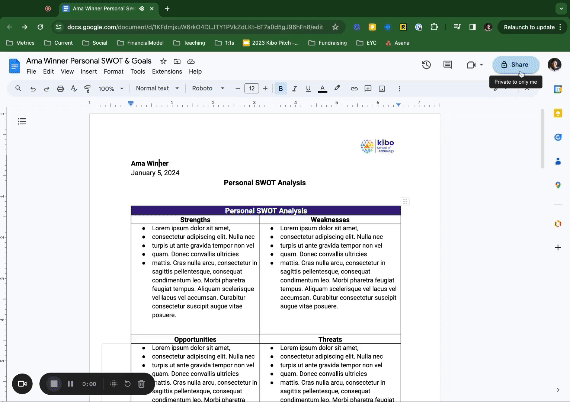

# Project: Technical Blog Post

In this project, you will write a technical blog post. Your post should be a "how to" on any technical topic (e.g., how to build an app using Google Sheets and Glide.) Assume the audience of the blog post has basic technical proficiency. 

Your blog post should:
- Be 1000 - 1500 words
- Persuade, i.e., convey information and convince the reader to use your tool
- Inform, i.e., provide the reader with helpful knowledge and insight
- Instruct, i.e., teach the reader how to do something or provide them with the information they need to complete a task

## Tips

- Read [this article](https://www.freecodecamp.org/news/how-to-write-a-great-technical-blog-post-414c414b67f6/) to get some guidance on writing a great technical blog post. You don't need to worry about publishing or promoting your blog post for this assignment, so you can skip over those sections of the article.
- Refer to the steps of the writing process in creating your blog post
- After finishing your blog post, use an AI tool of your choice (e.g., ChatGPT, Gemini, Claude) to evaluate your writing against the 7Cs. 
- Based on the AI feedback, revise your blog post. 

## Submission
You will submit the first draft, the link to the AI prompt and feedback, and your blog revision 

> Complete this [form](https://airtable.com/appdi1dZ5NJo3ryDG/pagYtUGRbtNcz6nrP/form) to submit your projects.

> Ensure the documents are set to enable to comment. See below for a demo of how to change sharing settings. 
     
