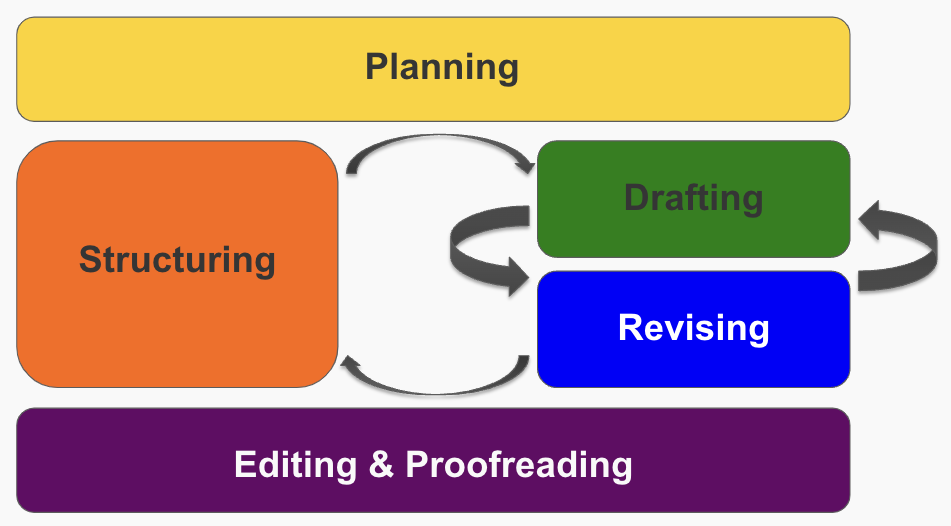

# The Writing Process

Now that we have explored how to evaluate the quality of writing writing, let's explore _how_ to write well. In particular, we focus on developing a writing process to produce effective writing. 

## Combating Writer's Block
Many of us experience paralysis at the beginning of the writing process, often termed "writer's block." What's going on in our heads when we struggle to write?

> 📺 Watch the following video to learn about the voices in your head that cause Writer's Block (3:14)

<iframe src="https://www.youtube.com/embed/fnWySbdVxFA" title="YouTube video player" frameborder="0" allow="accelerometer; autoplay; clipboard-write; encrypted-media; gyroscope; picture-in-picture" allowfullscreen style="position: absolute; top: 0; left: 0; width: 100%; height: 100%;"></iframe>

To best utilise each of these writing voices, it is helpful to use a standard process with deliberate steps that help get the most out of the madman, architect, carpenter, and judge at the appropriate time. This is called the **writing process**, and we will explore its steps in the next section.

## The Writing Process

> 📺 Watch the following video on the writing process.

<iframe src="https://www.youtube.com/embed/wEe7WZnEj60" title="YouTube video player" frameborder="0" allow="accelerometer; autoplay; clipboard-write; encrypted-media; gyroscope; picture-in-picture" allowfullscreen style="position: absolute; top: 0; left: 0; width: 100%; height: 100%;"></iframe>

<aside>
    The video uses slightly different terminology than what we use below. What is called "Invention" in the video is the same step as our "Planning" step. While what is called "Planning" in the video, is the same step as our "Structuring" step.
</aside>

## Exploring the Steps of the Writing Process

Similar to how communication can be broken down into steps, writing can also be decomposed into a sequence of actions. These actions allow a writer to efficiently navigate the journey from formulating an idea in their head to transmitting it effectively to an audience in written form. This writing process is made up of five main steps: 1) Planning, 2) Structuring, 3) Drafting, 4) Revising, and 5) Editing & Proofreading, shown in the image below. 

1. **Planning**
    
    The goals of the planning step are to 1) clarify the purpose of your writing, 2) think about who your audience is and how you can tailor your writing to them, 3) gather the information that you will need to support your purpose, and 4) identify the best channel to transmit your writing. Planning occurs _before_ creating the content of your message.
    
2. **Structuring**
    
    The goal of the structuring step is to determine how to organise your information to achieve your chosen purpose for your specific audience.
    
3. **Drafting**
    
    The goal of the drafting step is to create the first draft of your communication.
    
4. **Revising**
    
    The goal of the revising step is to evaluate your draft to see if it achieves your purpose. If not, you can revise the content until it does.
    
5. **Editing & Proofreading**
    
    The goal of the editing and proofreading steps is to correct any remaining errors and finalise your text.
    
---

### Why Use a Process?

It is helpful to separate writing into distinct steps. The alternative is an overwhelming writing method in which you are trying to remedy all writing issues simultaneously. For example, trying to draft text while thinking about the most coherent logical flow and paying attention to grammar and spelling errors. Unfortunately, this often leads to doing all the writing tasks poorly, or at the very least, inefficiently. Instead, when using this process, you can focus on the task at hand in each step. 

The writing process pushes you to be intentional and focused in the way in which you write. For example, how often do you ask yourself what you want to achieve with a particular piece of writing before you start? The simple act of asking this question can significantly impact the effectiveness of your writing. Or, when you want to communicate something, how often do you stop to consider the best channel for your communication? Do you take time to think about who will be receiving the message and the impact that has on the message content? Starting with a planning step can help you consider these things first and avoid the communication barriers that result in miscommunications.

While planning before you start writing is excellent for setting your intention, sometimes even the best intentions do not go to plan. Therefore, having a distinct revision step allows you to review what you have written and compare it to your intention. You can ask yourself the question: *Does what I have written achieve my purpose?* 

Finally, saving the proofreading step to the end is a great way to be more efficient. There is often no point in proofreading your text for perfect spelling and punctuation while writing because you might end up deleting whole sections of text that you have meticulously proofed. Therefore, view proofreading as the final polishing step that you use to remove any last distractions from your text. Modern technology also means that there are a variety of tools that you can use to help with this proofreading step, further freeing you to focus on the other more critical parts of the writing process.

You may have noticed that the Flowers Paradigm aligns well with this model of the writing process.

- During the **planning** step, you will wear your **Madman** hat for some actions.
- During the **structuring** step, you will wear your **Architect** hat.
- During the **drafting** step, you will wear your **Madman** and **Carpenter** hat.
- During the **revising, editing,** and **proofreading** steps, you will wear your **Judge** hat.

It is also helpful to think about the amount of time you should be spending in each of these phases. For example, if you have 1 hour to create and finalise a written text, you should ideally spend around 40% of the time in the Planning and Structuring stages, 20% of the time in the Drafting stage, and 40% of the time in the Revising, Editing, and Proofreading stage. However, as you personalise the writing process to suit your needs, you should adjust these distributions so that they make the most sense for you.

The writing is not linear. There will be a lot of back and forth between steps, especially between the organising, drafting, and revising as you try to ensure that what you have written achieves your purpose. This is also apparent with the arrows in the original diagram of the 5-step writing process.

> 🗣 **"Too often, we make major communications decisions without thinking them through at all. Or we just say or write whatever first comes to mind...There are always choices to be made. The most effective [communicators] will make them quickly, but also wisely."**
>
> - Francis J. Kelly and Heather Mayfield Kelly
